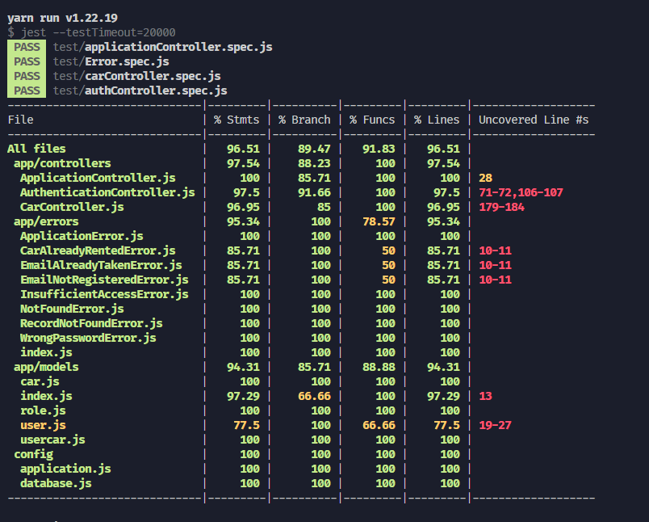

<div id="top">
    <br />
    <h1 align="center">BCR API</h1>
</div>

This project was created to fulfill the assessment of `Binar Academy FSW-3 chapter-8` which contains a RESTFULL API built with expressJS combined with SwaggerUI for API documentation. check this [repository](https://github.com/trisnawahyudiii/BCR-API) for the Project Files.

-   Repository &emsp; : [Click Here](https://github.com/trisnawahyudiii/BCR-API)
-   Deployment &ensp;: [Click Here](https://trisnawahyudiii-bcr-api.up.railway.app/)

## How to Run This Project

1. Clone the repo
    ```sh
    git clone https://github.com/trisnawahyudiii/BCR-API
    ```
2. Install packages
    ```sh
    yarn install
    ```
3. Next Step

    ```sh
    - setting file config/database.js or you can create a .env file
    - run command : npm run db:setup || yarn db:setup
    ```

4. Run

    ```sh
    yarn develop
    ```

## Test Result

This project was tested using jest and supertest. This project also using EsLint as the code linter.



<p align="right">(<a href="#top">back to top</a>)</p>
